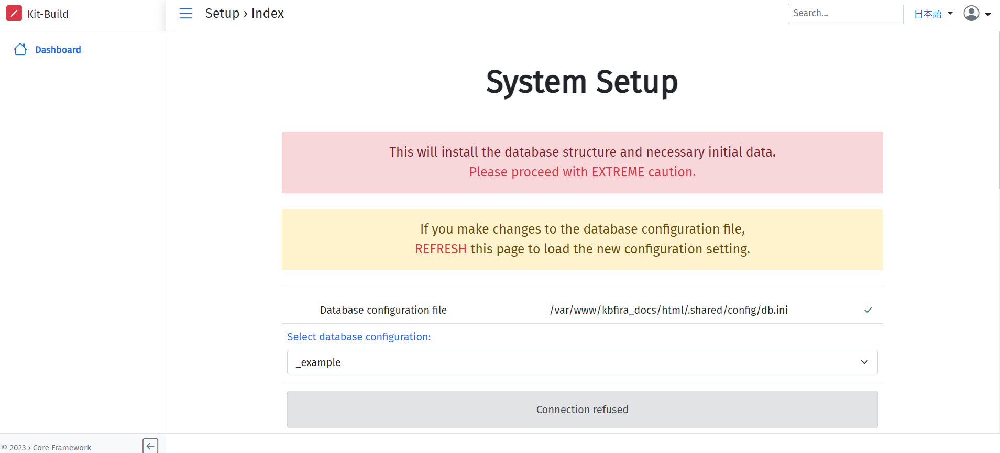
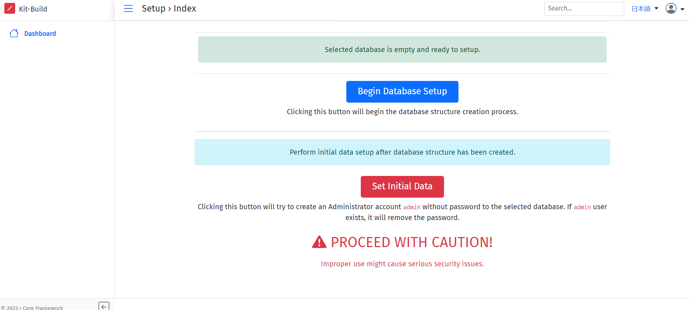

# docker環境構築
1. docker公式よりPCにdockerをダウンロードして下さい(Windowsの場合はDockerのインストール方法(Windows).mdを参照して下さい)
1. Code>Downloadよりkbfira_setup-main.zipをダウンロードして下さい
1. 以下のコマンドを実行してkbfira_setup-main/nginx/kbfira_docs/html下にcloneして下さい
    ```
    git clone https://github.com/LearningEngineeringLaboratory/kbfira_docs.git
    ```
1. kbfira_setup-mainに移動し,以下のコマンドを実行して下さい
    ```
    docker-compose up -d　
    ```
1. 以下のコマンドより,nginxとmysqlのコンテナが作成されたか確認して下さい
    ```
    docker ps
    ```
    以下のように表示されればOK
    | CONTAINER ID | IMAGE | COMMAND |CREATED|STATUS|PORTS|NAMES|
    |:-------|:--------|:-------|:-------|:--------|:-------|:-------:|
    |...      |kbfira_setup-main-nginx        |"/sbin/my_init"       |...|...|0.0.0.0:8081->80/tcp |nginx-container|
    |...     |mysql:latest         |"docker-entrypoint.s…"      |...|...|33060/tcp, 0.0.0.0:3308->3306/tcp|mysql-container|

1. ブラウザで以下のURLにアクセスして下さい
    http://localhost:8081/kbfira_docs/index.php/admin/m/x/app/setup
    
1. データベースの初期化を行うために,Select databese configuration:のプルダウンからkbv2-firaを選択して下さい
1. 続いて下に移動して,Begin Database Setupボタンを押して下さい※ボタンを押すと確認画面が出ますが,Yesを選択して下さい
    
1. 続いてその下にあるSet Initial Dataボタンを押して下さい
1. 動作確認をするために,右上の人アイコンをクリックしてSign inボタンを押し,Usernameの欄に"admin"を入力し(パスワード欄は不要),サインインを行なって下さい
1. 右上に Sign is successfulと表示されログインできれば,環境構築完了です

<br>

# dockerコマンド一覧
```
docker images #イメージ確認
docker ps (-al) #コンテナ確認(-alをつけると停止中のコンテナも表示)
docker-compose up -d #ymlファイルを用いたコンテナ作成
docker run -it (コンテナ名:ID) /bin/bash #コンテナ起動
docker exec -it (コンテナ名:ID) /bin/bash #コンテナへアクセス
docker stop ID #コンテナ停止
docker rm ID #コンテナ削除
docker logs ID #エラー時などのログ確認
docker-compose logs (コンテナ名) #docker-composeでのログ出力,コンテナ名を指定するとその箇所のみのログを出力
```
# LiveServer実装
1. 以下の記事(URL)より,手順に沿ってインストールして下さい
    https://web-niar.com/blog/vscode-liveserver-mamp/
1. 手順1~5のうち2と5は不要
1. 手順4のActual Server Addressを http://localhost:8081 に, Live Server Address を http://localhost:5500/ に設定しApply